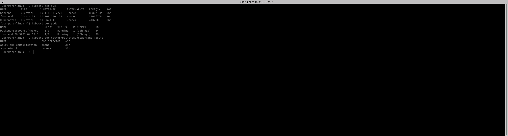
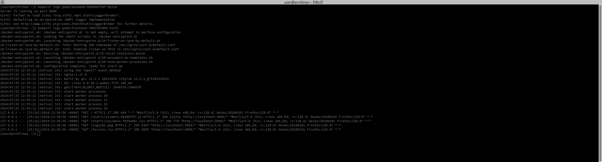
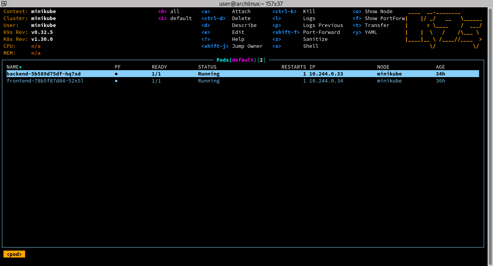
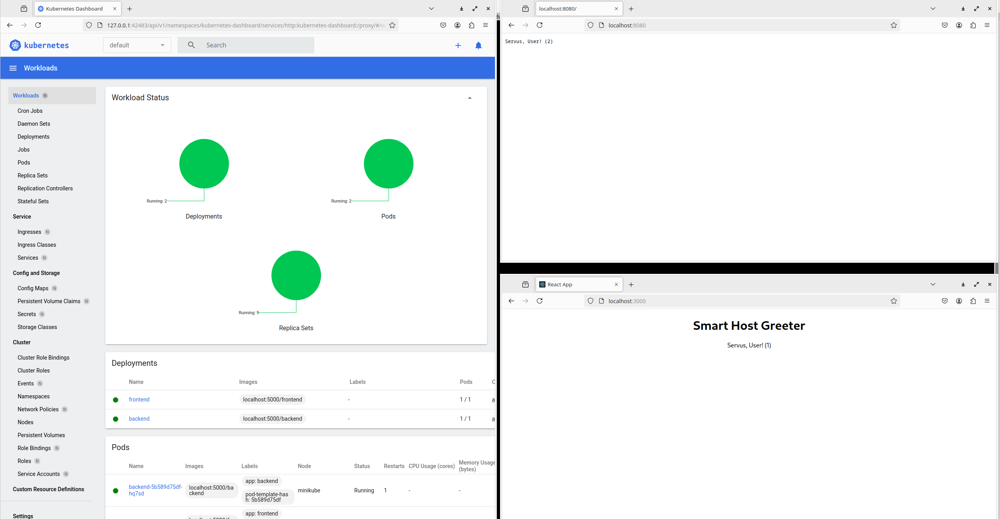

# Report

## Screenshots

Pods and svc via kubectl

Logs from running backend and frontend via kubectl

View of k9s

View of app

[video from app](app.mp4)

### Questions about CI/CD, Metrics, Logging

1. **CI/CD**
   - How would you set up a basic CI/CD pipeline to build, test, and deploy the microservices to the remote Kubernetes cluster?
     - Using Jenkins or using for example Azure DevOps (better with ArgoCD)
   - What deployment strategy would you recommend for deploying updates to the microservices in the Kubernetes cluster, and how would you implement it in the CI/CD pipeline?
     - Blue-Green Deployment via ArgoCD

2. **Metrics**:
   - What tools or platforms do you use for collecting and visualizing metrics in a Kubernetes environment?
     - Prometheus and Grafana
   - What are some key metrics you would monitor for a Kubernetes cluster and why?
     - CPU/memory usage, pod availability, request latency, error rates, provide insights into resource usage, performance, and potential issues

3. **Logging**:
   - Describe your approach to centralized logging in a Kubernetes environment.
     - ELK stack + Prometheus
   - What tools do you prefer for log aggregation and analysis, and why?
     - ELK with Prometheus for its robustness, scalability, and powerful search capabilities

4 **Monitoring**:
   - What is your process for setting up monitoring alerts in Kubernetes?
     - Setup monitoring alerts with Prometheus Alertmanager to notify on-call about critical issues
   - How do you ensure high availability and fault tolerance in your monitoring setup?
     - Prometheus and Alertmanager in a highly available configuration, ensure redundancy and failover mechanisms are in place