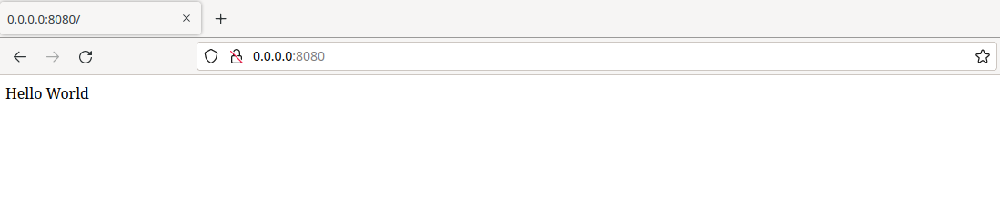

# For Scramjet company
- [Company website](https://scramjet.org/)
- [Company LinkedIn](https://www.linkedin.com/company/scramjet/)

In this folder you will find a recruitment task performed for the company in accordance with the attached instructions.

The instructions can be found in the PDF file.

[PDF with instructions](devops_tasks_eng.pdf)

# Screenshots


# Build
> How to build. Only part of the task can be built on the local machine.

Podman

```
podman-compose up -d
```

Docker

```
docker compose up -d
```


# Software versions

- Docker engine v23.0
- Docker compose plugin v2.16
- Podman engine v4.3
- Podman compose v1.0
- Helm v3.11