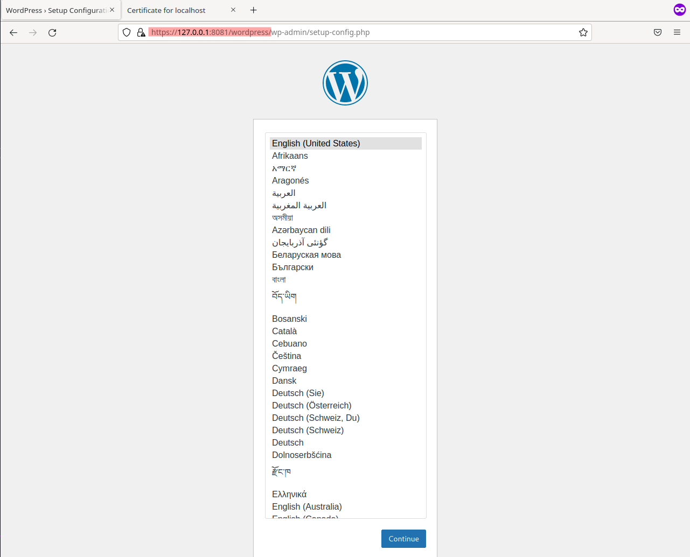
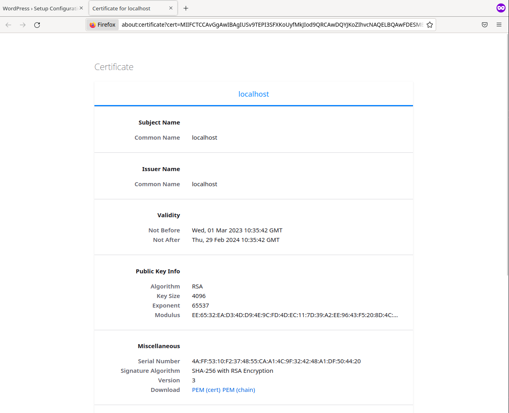
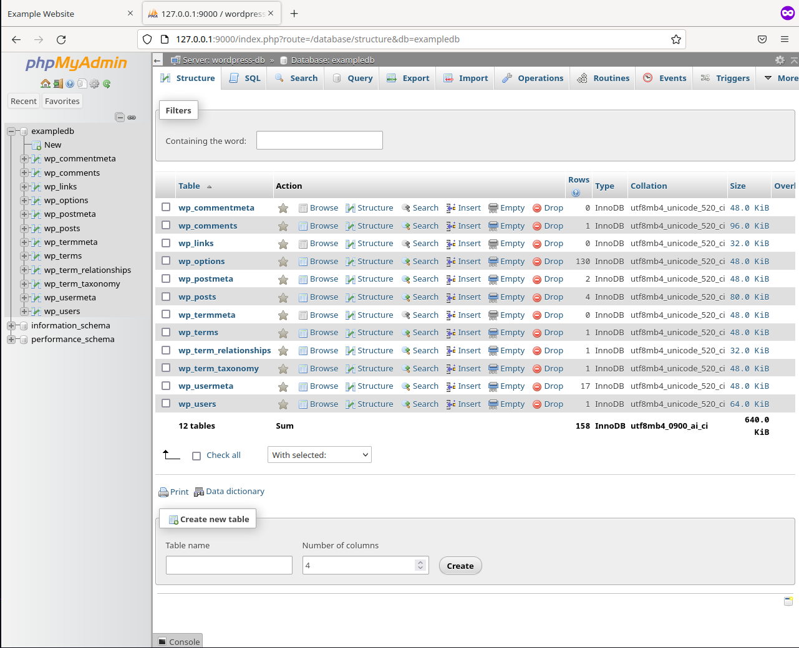
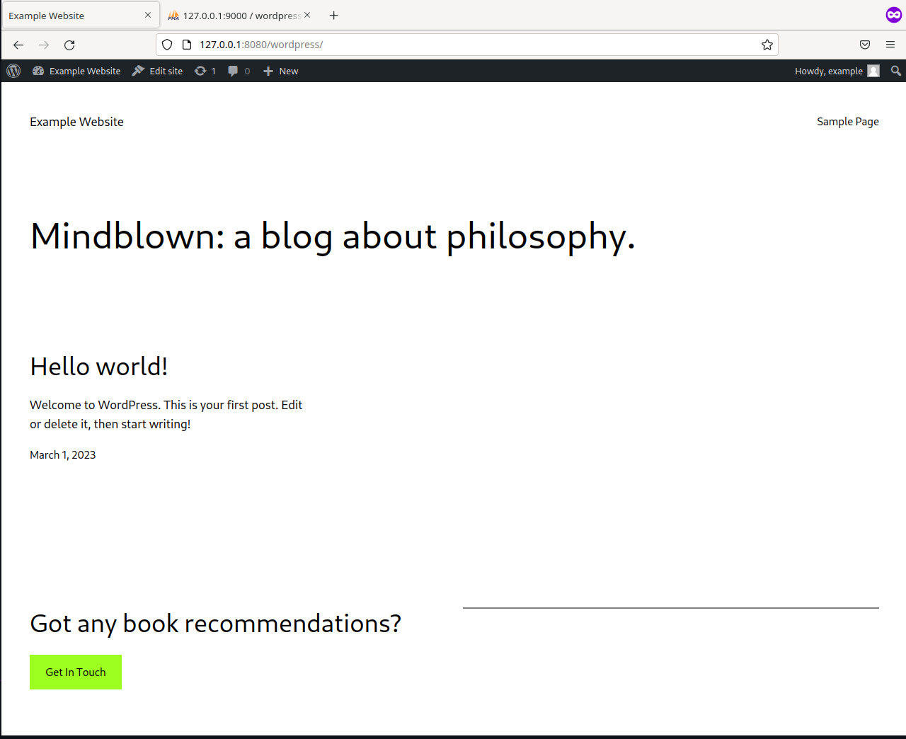

# For T2G Europe company
- [Company website](https://t2geurope.com/)

In this folder you will find a recruitment task performed for the company in accordance with the attached instructions.

The instructions can be found bellow.
> "Utwórz docker-compose z działającym Wordpressem. Spraw, aby strona była
dostępna po HTTPS podczas stawiania Dockera na localhost. Oprzyj
kontenery Dockera o własne obrazy wywiedzione z Ubuntu (FROM ubuntu)"

# Screenshots

WordPress running locally over HTTP.


WordPress running locally over HTTPS.


An example of a certificate generated for HTTPS connections.


Access to phpMyAdmin.


WordPress with example content.


# Build
> How to build.

Podman

```
podman-compose up -d
```

Docker

```
docker compose up -d
```


# Software versions

- Docker engine v23.0
- Docker compose plugin v2.16
- Podman engine v4.3
- Podman compose v1.0